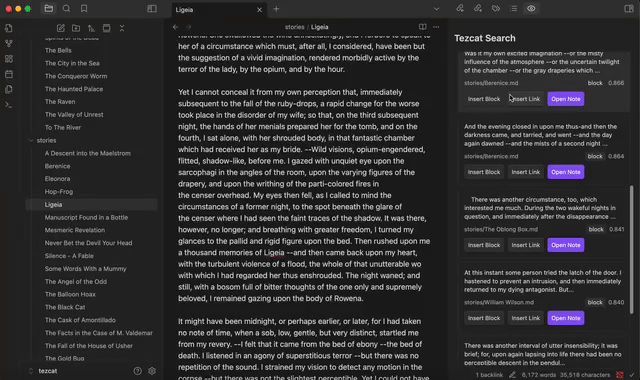

# `tezcat`

Tezcat is an Obsidian plugin that indexes your thoughts. It uses a aritificial intelligence (AI) embedding vectors to surface related content fragments and notes as you write, enhancing your creative recall in the style of a [remembrance agent](https://www.bradleyrhodes.com/Papers/remembrance.html). Search results yield items at both a Note and a Block (section, in Obsidian) level, and you can use them to insert links to the source, insert the content itself, and open the parent page where the content comes from.

Search implementation options are currently naive **vector search** and an implementation of **hybrid search**, where vector similarity and full text search are combined to include more text matches (and less machine intuition).

This tool works best with Ollama in the current state. It frequently makes calls to generate embeddings and search its database, and if you use a proprietary embeddings endpoint this may incur undesired costs.

# Requirements

## Local
In order for Tezcat to work properly with local AI models, you must have a local model provider installed and running. There are a couple of good providers for local models, but for now the current system only enables:
- [Ollama](https://ollama.com/download)

Go to the download page, install the software, and boot it up on your machine. Tezcat will download the correct embedding models from Ollama for you.

If you are on **Linux** you may need to manually run `ollama serve` in terminal after installed.

## Non-Local
For proprietary embedding models, we currently only support OpenAI embedding models. Use this option if you don't want to use local-running models.

# Technical Considerations

Currently supported local embedding models via Ollama are:
- [Nomic Embed v1.5](https://huggingface.co/nomic-ai/nomic-embed-text-v1.5), 768 dimensions (or less due to Matryoshka Embeddings)
- [BGE M3](https://huggingface.co/BAAI/bge-m3), 1024 dimensions

# Installation

I would recommend using Tezcat with [Ollama](https://ollama.com/download). Ollama is a tool that lets you run open source large language models **locally** on your machine, giving you ownership over your information.

1. Install and start Ollama on your computer
2. Download this plugin from the Obsidian community plugins
3. Enable this plugin

Alternatively, you can run the latest version of Tezcat by cloning this repository.

1. Clone the repository
2. Move the repository to `your_vault_path/.obsidian/plugins/`
3. Navigate to `tezcat`
4. `npm install`
5. `npm run dev`
6. Enable this plugin in the Obsidian settings

# Usage
Select your model, allow the plugin to build the vector database, and you should be good to go! Search results appear in a "view" in Obsidian. For usage:
- If you click a search result, it copies:
  - An Obsidian link to your clipboard if it's a note
  - The text content to your clipboard if it's a fragment
- Search results also allow you to, depending on whether the result is a Note or a fragment:
  - Insert a link to a page
  - Insert the text at the cursor
  - Open the page (at the location of the content)

If you find that the search is becoming slower, try running "Tezcat: Rebuild Vector Index" from the command palette.

Generally, if there is any trouble with the plugin (which you can see either via Notices in Obsidian or the console logs in the application (Option + Command + I)), you should be able to fix them by running "Tezcat: Rebuild Database" from the command palete (Command + P)
